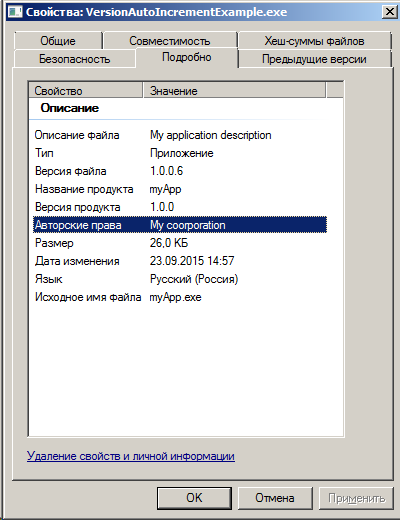
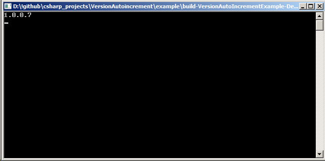

#Version autoincrement
Небольшая программа написанная на c#, которая помагает создавать qmake проекты с возможностью автоинкремента версии сборки
Так же формирует rc файл, которые можно подключить к проекту, чтобы версия сборки отображалась в свойствах программы/библиотеки

